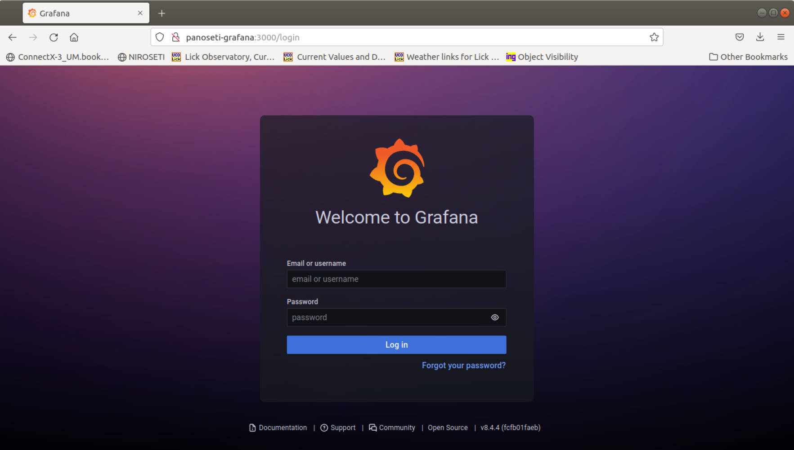

# PANOSETI-Docker
## Descriptions
&ensp; These scripts are used for setting up a head node for the PANOSETI control system.  
&ensp; Before using the scripts, please make sure docker has been installed.  
&ensp; If it's not installed, please follow the instructions [here](https://docs.docker.com/engine/install/).
## How to use it
1. Clone the reposiitory  
```
    git clone https://github.com/liuweiseu/panoseti_docker.git
```
2. run 
```shell
    ./panoseti_build_image.sh
```
&ensp; All the necessary images will be pulled from docker hub.  
&ensp; The panoseti_control image will be built based on the Dockerfile.  
&ensp; ***Note***: This script only needs to be ran one time normally.  

3. run
```shell
    ./panoseti_create_containers.sh
```
&ensp; All the containers will be created.  
&ensp; ***Note***: This script only needs to be ran one time normally. 

4. run
```shell
    ./panoseti_start_containers.sh
```
&ensp; All of the containers should be running now!

5. run
```shell
    ./panoseti_terminal.sh
```
&ensp; You should have a termial now!  
&ensp; All of the python control scripts are there.  
&ensp; Some times, you may need to use
```
    git pull origin master
```
to get the latest code.

## Access to grafana
&ensp; As all of the containers are running, you should be able to access grafana.  
&ensp; Just type in
```
    panoseti-grafana:3000
```
&ensp; in your browser, then you should see  
  

&ensp; If you can't access grafana successfully, try the following command:
```shell
    sudo systemctl stop systemd-resolved.service 
```

## Start and Stop Containers
&ensp; By default, the containers are running after you create them.   
&ensp; You can run 
```shell
    ./panoseti_stop_containers.sh
```
&ensp; to stop all the containers. (Normally, we don't need to do this.)  
&ensp; When you plan to restart the containers or you restarted the physical machine, you just need to run
```shell
    ./panoseti_start_containers.sh
```

## Delete Containers
&ensp; Sometimes, you may want to delete all of the containers to make the machine clean.  
&ensp; Then you just need to run
```
    ./panoseti_del_containers.sh
```
